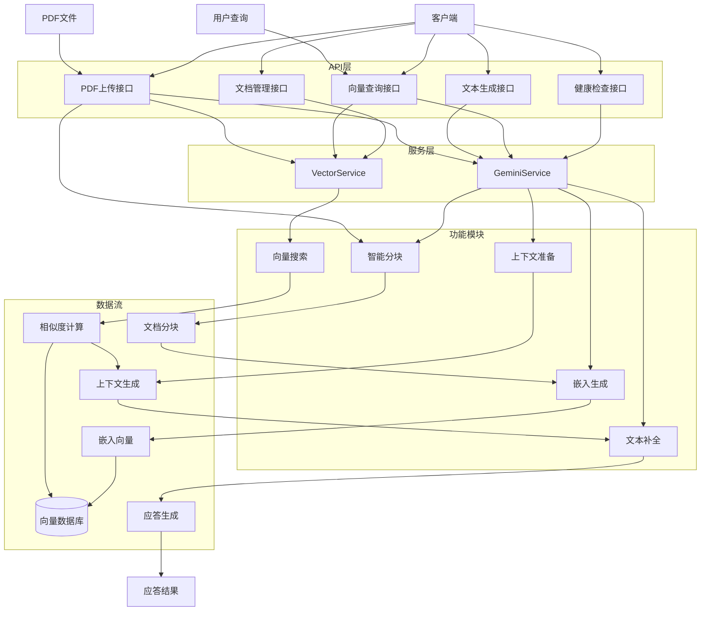
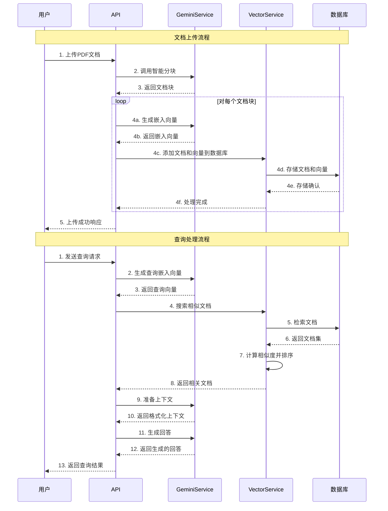
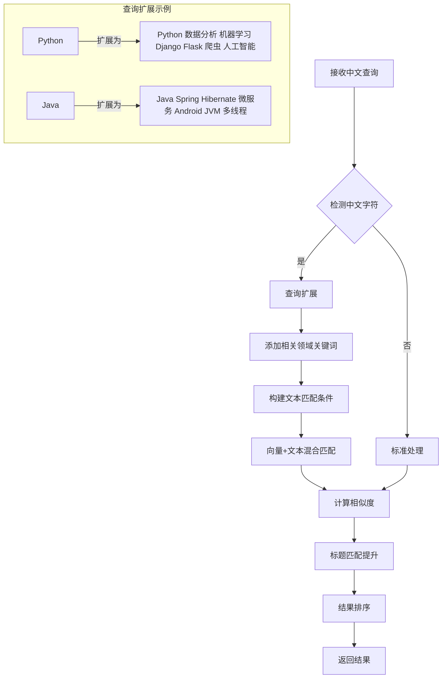

# Gemini向量搜索系统

基于Google Gemini模型的文档检索和分析系统，支持PDF文档上传、智能分块、向量搜索以及基于文档内容的问答功能。

## 快速安装

```bash
# 克隆仓库
git clone https://github.com/yourusername/gemini-vector-search.git
cd gemini-vector-search

# 执行安装脚本
chmod +x install.sh
./install.sh

# 启动服务
npm start
```

## 系统架构



## 主要处理流程



## 中文内容处理优化



## 主要功能

1. **文档管理**
   - PDF文档上传和解析
   - 智能文档分块
   - 文档向量化存储

2. **向量搜索**
   - 语义相似度检索
   - 中文内容优化
   - 按文档源过滤

3. **智能问答**
   - 基于文档内容的问答
   - 结构化内容分析
   - 自动摘要生成

## API详解

### 集成查询端点

`POST /api/v1/integration` 是系统的核心端点，结合了向量检索和AI生成功能，为用户提供一站式问答体验。

#### 请求体结构

```json
{
    "prompt": "你想提问的问题，例如：Python如何处理异常？",
    "context_query": "Python 异常 try except",
    "max_context_docs": 5
}
```

#### 参数说明

| 参数 | 类型 | 必填 | 说明 |
|------|------|------|------|
| prompt | string | 是 | 用户的问题或提示，AI将基于此生成回答 |
| context_query | string | 否 | 用于向量检索的查询文本，如果不提供则使用prompt的值 |
| max_context_docs | integer | 否 | 检索的最大文档数量，默认为5，建议范围1-10 |

#### 查询参数

| 参数 | 类型 | 必填 | 说明 |
|------|------|------|------|
| source_filter | string | 否 | 按文档来源筛选，例如：`python_docs.pdf` |
| debug | boolean | 否 | 是否返回详细的调试信息，默认为false |

#### 响应结构

```json
{
    "completion": "基于文档内容生成的回答...",
    "debug_info": {
        "original_query": "原始查询",
        "search_query": "扩展后的搜索查询",
        "docs_found": 5,
        "context_length": 1250,
        "document_snippets": ["文档片段1...", "文档片段2..."]
    }
}
```

> 注意：`debug_info` 字段仅在请求参数中 `debug=true` 时返回

#### 工作原理

1. 系统接收用户的问题（prompt）
2. 使用context_query（或prompt）执行向量搜索，匹配最相关的文档
3. 对中文查询进行自动扩展，提高相关性
4. 提取匹配文档的内容并构建上下文
5. 将问题和上下文一起发送给Gemini模型
6. 返回基于文档内容的生成回答

#### 使用示例

```bash
curl --location 'http://example.com:8000/api/v1/integration' \
--header 'Content-Type: application/json' \
--data '{
    "prompt": "Python中如何优雅地处理异常？",
    "context_query": "Python 异常处理 最佳实践",
    "max_context_docs": 5
}'
```

## 环境设置

1. 复制环境变量示例文件或使用安装脚本自动创建
   ```
   cp .env.example .env
   ```

2. 编辑`.env`文件，填入你的API密钥和数据库配置:
   ```
   GOOGLE_API_KEY=your_google_api_key
   POSTGRES_HOST=localhost
   POSTGRES_PORT=5432
   POSTGRES_DB=gemini
   POSTGRES_USER=postgres
   POSTGRES_PASSWORD=postgres
   ADMIN_USERNAME=admin
   ADMIN_PASSWORD=password
   ```

## 运行服务

提供多种启动方式:

### 使用NPM脚本(推荐)

```bash
# 安装依赖
npm install

# 启动全部服务（前端和后端）
npm start

# 仅启动前端
npm run start:frontend

# 仅启动后端
npm run start:backend

# 开发模式（自动重载）
npm run dev

# 查看日志
npm run logs           # 实时查看最新日志
npm run logs:frontend  # 仅查看前端日志
npm run logs:backend   # 仅查看后端日志
```

### 使用启动脚本

```bash
# 启动全部服务（前端和后端）
node start.js

# 仅启动前端
node start.js --mode=frontend

# 仅启动后端
node start.js --mode=backend

# 自定义端口
node start.js --frontend-port=8080 --backend-port=9000

# 显示帮助信息
node start.js --help

# 启动并实时查看日志
node start.js --logs
```

### 直接启动后端

```bash
python main.py

# 或使用uvicorn
uvicorn app.main:app --host 0.0.0.0 --port 8000
```

### 使用Bash控制脚本

```bash
# 启动所有服务
./run.sh start

# 仅启动前端或后端
./run.sh start-frontend
./run.sh start-backend

# 停止服务
./run.sh stop

# 查看状态
./run.sh status

# 查看日志
./run.sh logs
```

### 命令行选项

| 选项 | 说明 | 默认值 |
|------|------|--------|
| `--mode` | 启动模式 (frontend\|backend\|all) | all |
| `--backend-host` | 后端服务主机 | 0.0.0.0 |
| `--backend-port` | 后端服务端口 | 8000 |
| `--frontend-host` | 前端服务主机 | 0.0.0.0 |
| `--frontend-port` | 前端服务端口 | 8080 |
| `--auto-reload` | 启用自动重载 | false |
| `--logs` | 启动后显示日志 | false |
| `--help`, `-h` | 显示帮助信息 | - |

## 日志管理

系统采用时间戳命名的日志文件，确保每次启动都会创建新的日志文件而不会覆盖历史记录：

```
logs/
├── backend/
│   ├── backend_20231020_123045.log  # 历史后端日志
│   ├── backend_20231021_083012.log  # 历史后端日志
│   └── backend_20231022_094517.log  # 最新后端日志
├── frontend/
│   ├── frontend_20231020_123045.log # 历史前端日志
│   ├── frontend_20231021_083012.log # 历史前端日志
│   └── frontend_20231022_094517.log # 最新前端日志
├── backend_current.log -> backend/backend_20231022_094517.log  # 指向最新后端日志的符号链接
└── frontend_current.log -> frontend/frontend_20231022_094517.log  # 指向最新前端日志的符号链接
```

### 查看日志

可以通过以下方式查看日志：

1. **使用NPM脚本**：
   ```bash
   npm run logs           # 查看所有最新日志
   npm run logs:frontend  # 仅查看前端日志
   npm run logs:backend   # 仅查看后端日志
   ```

2. **使用控制脚本**：
   ```bash
   ./run.sh logs          # 显示前端和后端的最新日志
   ```

3. **直接查看日志文件**：
   ```bash
   # 查看最新日志（通过符号链接）
   tail -f logs/backend_current.log
   tail -f logs/frontend_current.log
   
   # 查看特定日志文件
   less logs/backend/backend_20231022_094517.log
   ```

## 使用Swagger API文档

系统内置了Swagger API文档界面，可以通过浏览器访问:

```
http://localhost:8000/docs
```

Swagger文档提供了:

1. 所有API端点的详细说明
2. 请求和响应模型的结构
3. 参数说明和示例值
4. 在线测试功能，可直接在浏览器中测试API

## 部署与使用

详细的API使用方法请参考 [Gemini向量搜索API使用指南.md](Gemini向量搜索API使用指南.md)。

### 快速开始

1. 检查系统健康状态 (`GET /api/v1/health`)
2. 上传PDF文档 (`POST /api/v1/upload-pdf`)
3. 使用集成查询端点发送问题 (`POST /api/v1/integration`)
4. 获取基于文档内容的回答 