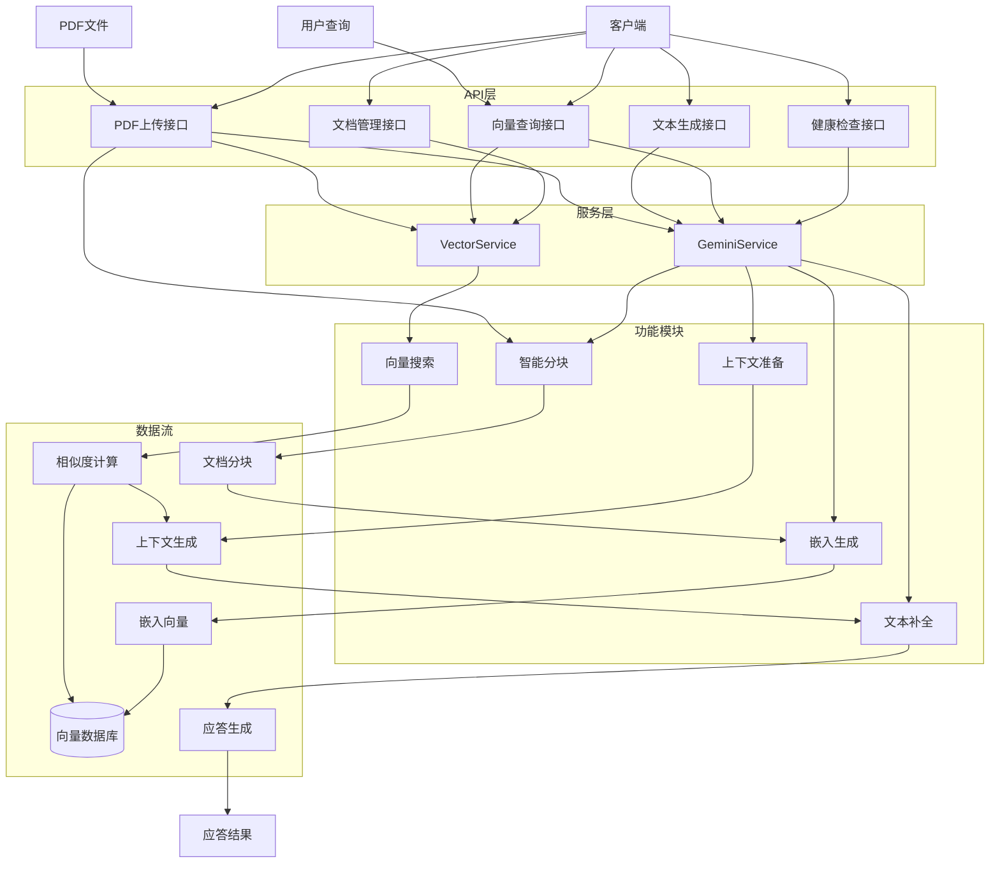
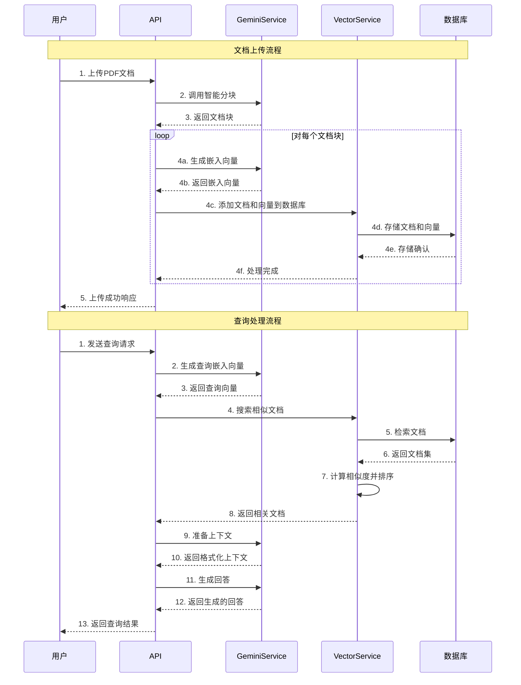
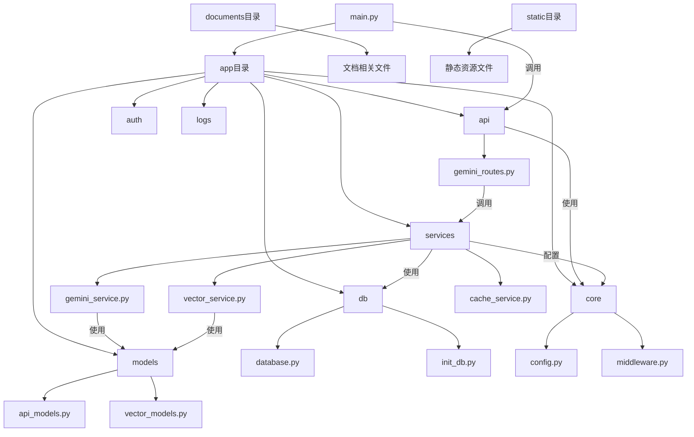
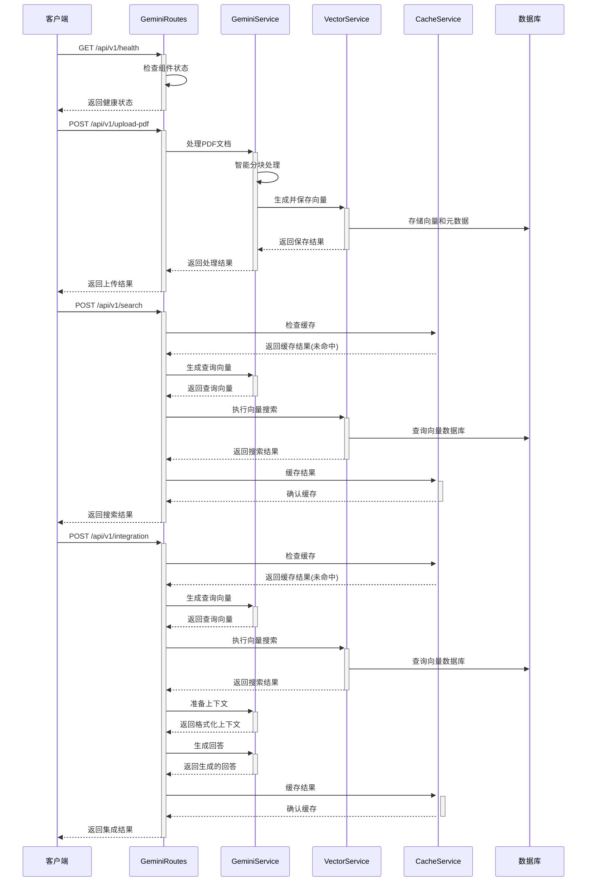
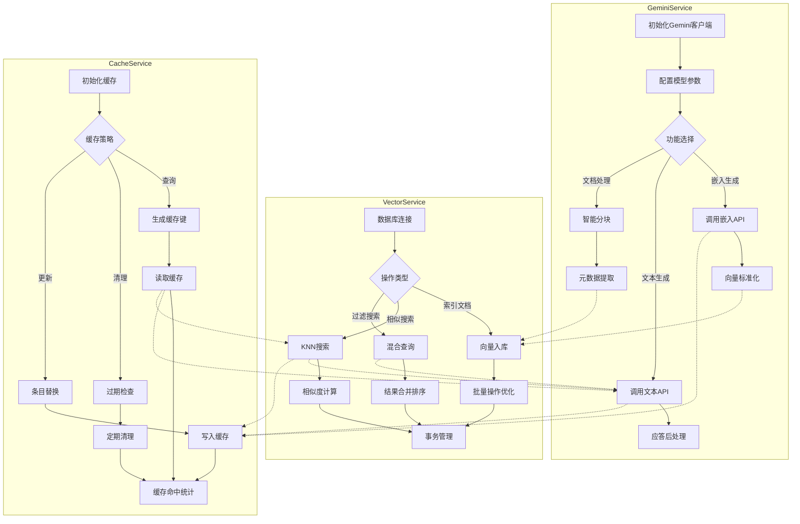
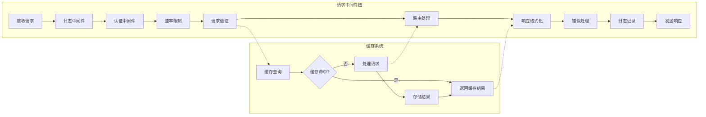
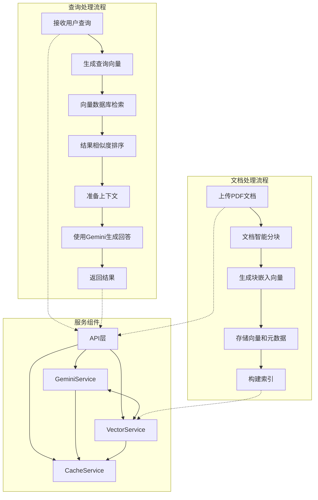
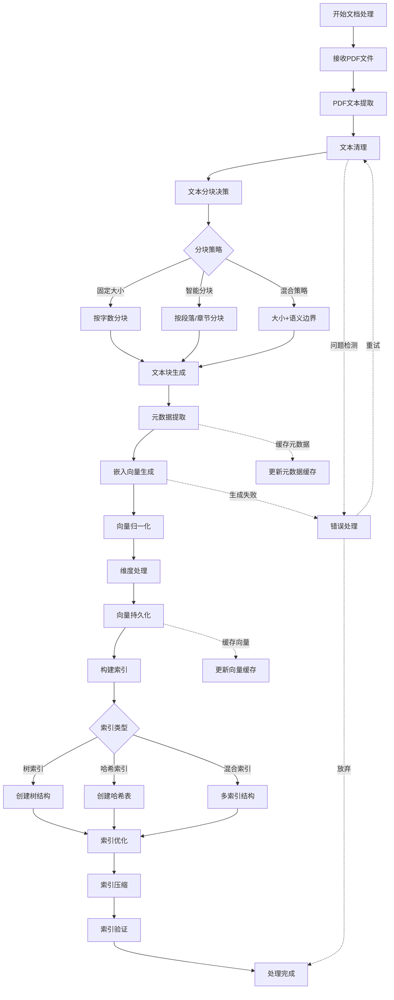
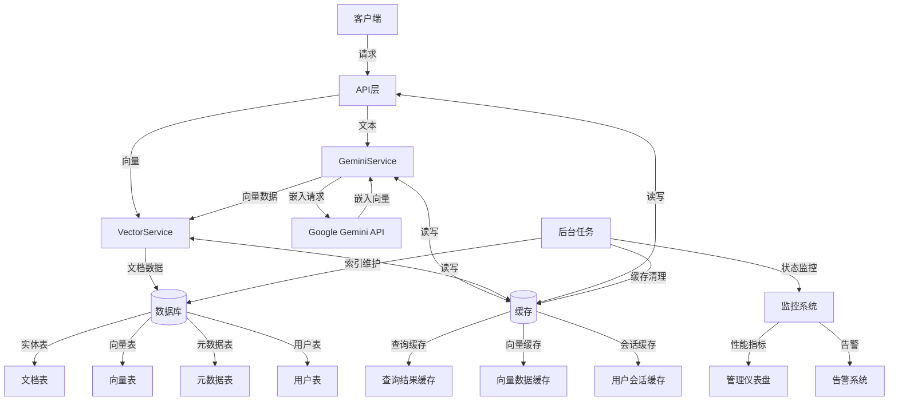

# Gemini向量搜索系统

基于Google Gemini模型的文档检索和分析系统，支持PDF文档上传、智能分块、向量搜索以及基于文档内容的问答功能。

## 系统架构



## 主要处理流程



## 主要功能

1. **文档管理**
   - PDF文档上传和解析
   - 智能文档分块
   - 文档向量化存储

2. **向量搜索**
   - 语义相似度检索
   - 按文档源过滤

3. **智能问答**
   - 基于文档内容的问答
   - 结构化内容分析
   - 自动摘要生成

## API详解

### 1. 集成查询端点

`POST /api/v1/integration` 是系统的核心端点，结合了向量检索和AI生成功能，为用户提供一站式问答体验。

#### 请求体结构

```json
{
    "prompt": "你想提问的问题，例如：Python如何处理异常？",
    "context_query": "Python 异常 try except",
    "max_context_docs": 5
}
```

#### 参数说明

| 参数 | 类型 | 必填 | 说明 |
|------|------|------|------|
| prompt | string | 是 | 用户的问题或提示，AI将基于此生成回答 |
| context_query | string | 否 | 用于向量检索的查询文本，如果不提供则使用prompt的值 |
| max_context_docs | integer | 否 | 检索的最大文档数量，默认为5，建议范围1-10 |

#### 查询参数

| 参数 | 类型 | 必填 | 说明 |
|------|------|------|------|
| source_filter | string | 否 | 按文档来源筛选，例如：`python_docs.pdf` |
| debug | boolean | 否 | 是否返回详细的调试信息，默认为false |
| force_use_documents | boolean | 否 | 强制使用文档内容回答，即使没有找到高相似度的匹配 |

#### 响应结构

```json
{
    "completion": "基于文档内容生成的回答...",
    "debug_info": {
        "original_query": "原始查询",
        "search_query": "扩展后的搜索查询",
        "docs_found": 5,
        "context_length": 1250,
        "document_snippets": [
            {
                "content": "文档片段1...",
                "similarity": 0.85,
                "source": "python_docs.pdf"
            },
            {
                "content": "文档片段2...",
                "similarity": 0.78,
                "source": "tutorial.pdf"
            }
        ]
    }
}
```

> 注意：`debug_info` 字段仅在请求参数中 `debug=true` 时返回

#### 使用示例

```bash
curl --location 'http://localhost:8000/api/v1/integration' \
--header 'Content-Type: application/json' \
--data '{
    "prompt": "Python中如何优雅地处理异常？",
    "context_query": "Python 异常处理 最佳实践",
    "max_context_docs": 5
}'
```

### 2. 上传PDF端点

`POST /api/v1/upload-pdf` 用于上传PDF文档，系统会自动提取文本、分块并生成向量存储。

#### 请求体结构

使用 `multipart/form-data` 格式提交数据：

| 参数 | 类型 | 必填 | 说明 |
|------|------|------|------|
| file | file | 是 | 要上传的PDF文件 |
| use_intelligent_chunking | boolean | 否 | 是否使用Gemini进行智能分块，默认为true |
| chunk_size | integer | 否 | 如果不使用智能分块，固定分块大小，默认1000 |
| overlap | integer | 否 | 如果不使用智能分块，块之间的重叠字符数，默认200 |
| clear_existing | boolean | 否 | 上传前是否清空数据库中的文档，默认为false |

#### 响应结构

```json
{
    "success": true,
    "filename": "example.pdf",
    "chunks_processed": 25,
    "document_ids": ["1", "2", "3", "..."],
    "chunking_method": "intelligent_chunking",
    "total_chunks": 25,
    "processed_chunks": 25
}
```

#### 使用示例

```bash
curl --location 'http://localhost:8000/api/v1/upload-pdf' \
--form 'file=@"/path/to/document.pdf"' \
--form 'use_intelligent_chunking="true"'
```

### 3. 向量搜索端点

`POST /api/v1/query` 在向量数据库中搜索与查询文本相似的文档。

#### 请求体结构

```json
{
    "query": "搜索查询文本",
    "limit": 10
}
```

#### 参数说明

| 参数 | 类型 | 必填 | 说明 |
|------|------|------|------|
| query | string | 是 | 搜索查询文本 |
| limit | integer | 否 | 返回结果数量限制，默认为5 |

#### 查询参数

| 参数 | 类型 | 必填 | 说明 |
|------|------|------|------|
| source_filter | string | 否 | 按文档来源筛选结果 |

#### 响应结构

```json
{
    "results": [
        {
            "id": "1",
            "content": "文档内容...",
            "title": "文档标题",
            "metadata": {
                "source": "document.pdf",
                "chunk": 1,
                "total_chunks": 25
            },
            "similarity": 0.92,
            "source": "document.pdf"
        },
        {
            "id": "2",
            "content": "另一个文档内容...",
            "similarity": 0.85,
            "source": "another_doc.pdf"
        }
    ]
}
```

### 4. 文本生成端点

`POST /api/v1/completion` 使用Gemini模型生成文本补全，可选择是否使用向量数据库中的相关文档作为上下文。

#### 请求体结构

```json
{
    "prompt": "你想提问的问题",
    "use_context": true,
    "context_query": "搜索相关内容的查询",
    "max_context_docs": 5
}
```

#### 参数说明

| 参数 | 类型 | 必填 | 说明 |
|------|------|------|------|
| prompt | string | 是 | 用于生成文本的提示 |
| use_context | boolean | 否 | 是否使用向量搜索结果作为上下文，默认为false |
| context_query | string | 否 | 用于向量检索的查询文本，需启用use_context |
| max_context_docs | integer | 否 | 上下文使用的最大文档数量，默认为5 |

#### 响应结构

```json
{
    "completion": "生成的文本内容..."
}
```

### 5. 嵌入向量生成端点

`POST /api/v1/embedding` 使用Gemini模型将文本转换为嵌入向量表示，用于相似度搜索。

#### 请求体结构

```json
{
    "text": "要转换为向量的文本内容"
}
```

#### 响应结构

```json
{
    "embedding": [0.1, 0.2, 0.3, ...]
}
```

### 6. 文档分析端点

`POST /api/v1/analyze-documents` 深入分析文档内容，提取关键概念和主题。

#### 请求体结构

```json
{
    "query": "分析主题",
    "limit": 10
}
```

#### 参数说明

| 参数 | 类型 | 必填 | 说明 |
|------|------|------|------|
| query | string | 是 | 分析主题或问题 |
| limit | integer | 否 | 分析使用的最大文档数量，默认为5 |

#### 响应结构

```json
{
    "completion": "详细的结构化文档分析结果..."
}
```

### 7. 获取文档列表端点

`GET /api/v1/documents` 获取存储在系统中的文档列表，支持分页和筛选。

#### 查询参数

| 参数 | 类型 | 必填 | 说明 |
|------|------|------|------|
| limit | integer | 否 | 返回的最大文档数量，范围1-100，默认为20 |
| offset | integer | 否 | 分页偏移量，用于分页查询，默认为0 |
| source | string | 否 | 按文档来源筛选 |

#### 响应结构

```json
[
    {
        "id": "1",
        "title": "文档标题",
        "content": "文档内容...",
        "metadata": {
            "source": "document.pdf",
            "chunk": 1,
            "total_chunks": 25
        },
        "created_at": "2023-01-01T12:00:00.000Z"
    },
    {
        "id": "2",
        "title": "另一个文档标题",
        "content": "另一个文档内容..."
    }
]
```

### 8. 获取单个文档端点

`GET /api/v1/documents/{document_id}` 根据ID获取单个文档的详细信息。

#### 路径参数

| 参数 | 类型 | 必填 | 说明 |
|------|------|------|------|
| document_id | string/integer | 是 | 文档的唯一标识符 |

#### 响应结构

```json
{
    "id": "1",
    "title": "文档标题",
    "content": "文档内容...",
    "metadata": {
        "source": "document.pdf",
        "chunk": 1,
        "total_chunks": 25
    },
    "created_at": "2023-01-01T12:00:00.000Z"
}
```

### 9. 健康检查端点

`GET /api/v1/health` 检查API服务是否正常运行，无需认证。

#### 响应结构

```json
{
    "status": "ok",
    "timestamp": "2023-01-01T12:00:00.000Z"
}
```

### 10. 数据库状态端点

`GET /api/v1/database-status` 检查数据库连接状态，无需认证。

#### 响应结构

```json
{
    "status": "connected",
    "timestamp": "2023-01-01T12:00:00.000Z"
}
```

## 环境设置

1. 复制环境变量示例文件或使用安装脚本自动创建
   ```
   cp .env.example .env
   ```

2. 编辑`.env`文件，填入你的API密钥和数据库配置:
   ```
   GOOGLE_API_KEY=your_google_api_key
   POSTGRES_HOST=localhost
   POSTGRES_PORT=5432
   POSTGRES_DB=gemini
   POSTGRES_USER=postgres
   POSTGRES_PASSWORD=postgres
   ADMIN_USERNAME=admin
   ADMIN_PASSWORD=password
   ```

### 直接启动后端

```bash
python main.py

# 或使用uvicorn
uvicorn app.main:app --host 0.0.0.0 --port 8000
```

### 使用Bash控制脚本

```bash
# 启动服务
./run.sh start

# 停止服务
./run.sh stop

# 查看状态
./run.sh status

# 查看日志
./run.sh logs
```

### 命令行选项

| 选项 | 说明 | 默认值 |
|------|------|--------|
| `--host` | 服务主机 | 0.0.0.0 |
| `--port` | 服务端口 | 8000 |
| `--auto-reload` | 启用自动重载 | false |
| `--logs` | 启动后显示日志 | false |
| `--help`, `-h` | 显示帮助信息 | - |

## 日志管理

系统采用时间戳命名的日志文件，确保每次启动都会创建新的日志文件而不会覆盖历史记录：

```
logs/
├── app_20231020_123045.log  # 历史日志
├── app_20231021_083012.log  # 历史日志
└── app_20231022_094517.log  # 最新日志
└── app_current.log -> app_20231022_094517.log  # 指向最新日志的符号链接
```

### 查看日志

可以通过以下方式查看日志：

1. **使用控制脚本**：
   ```bash
   ./run.sh logs  # 显示最新日志
   ```

2. **直接查看日志文件**：
   ```bash
   # 查看最新日志（通过符号链接）
   tail -f logs/app_current.log
   
   # 查看特定日志文件
   less logs/app_20231022_094517.log
   ```

## 使用Swagger API文档

系统内置了Swagger API文档界面，可以通过浏览器访问:

```
http://localhost:8000/docs
```

Swagger文档提供了:

1. 所有API端点的详细说明
2. 请求和响应模型的结构
3. 参数说明和示例值
4. 在线测试功能，可直接在浏览器中测试API

## 代码结构



## 代码结构详细图

### API交互流程



### 数据模型关系图


### 服务组件内部逻辑



### 缓存机制和中间件流程



### 查询处理流程



### 文档处理和向量索引详细流程



### 数据流转和存储层交互

