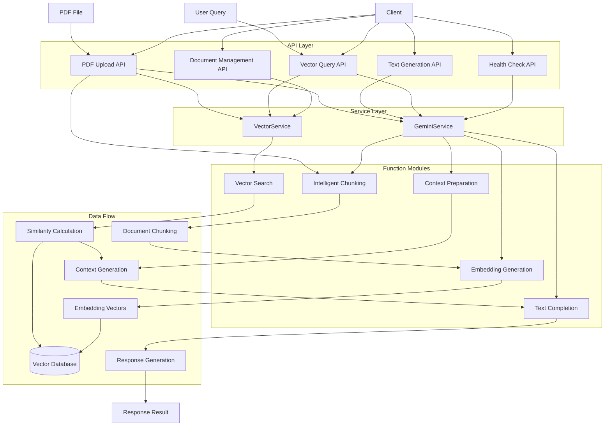
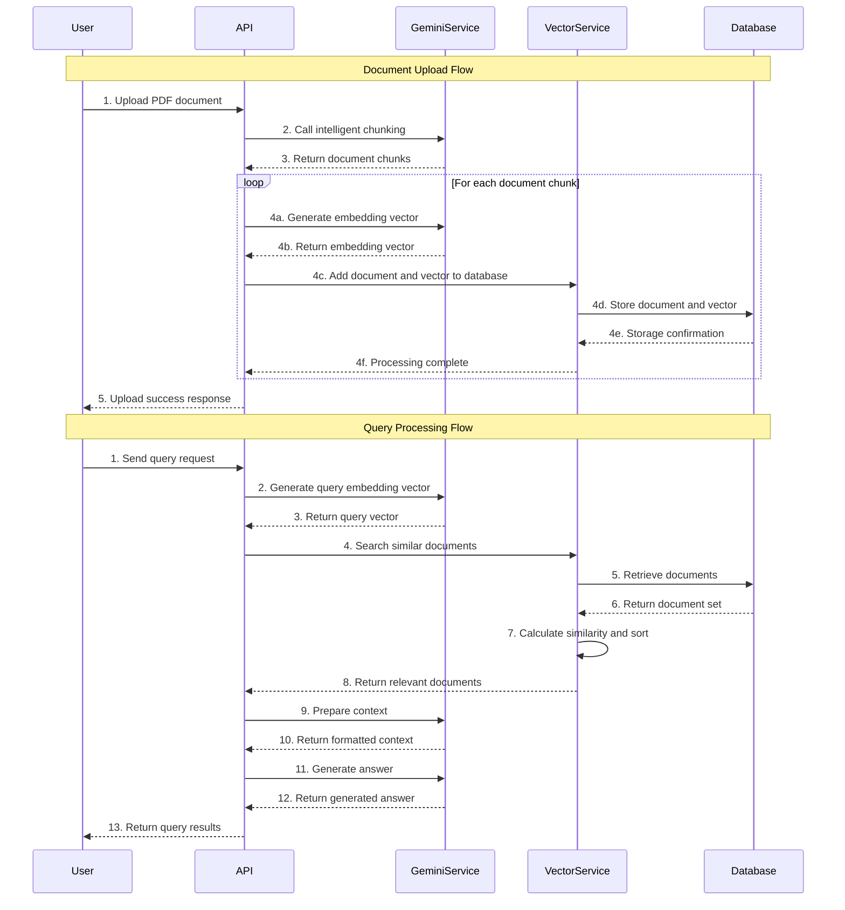
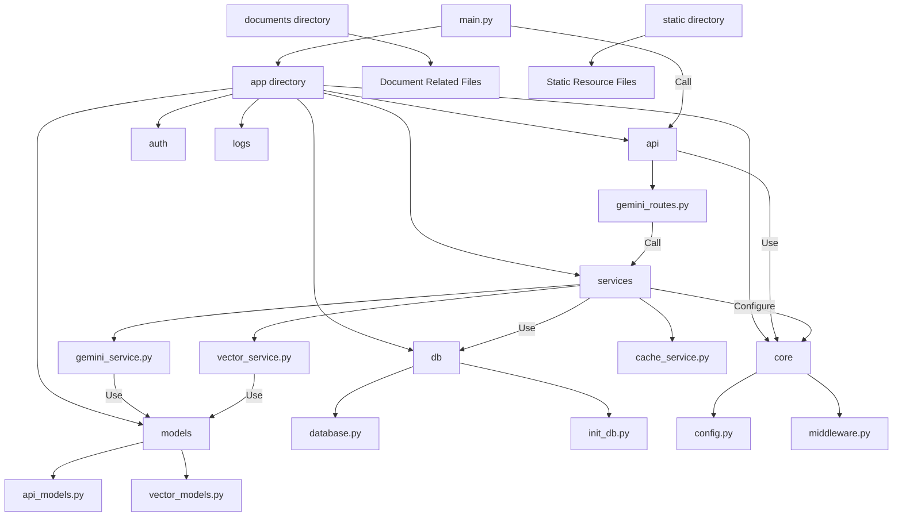
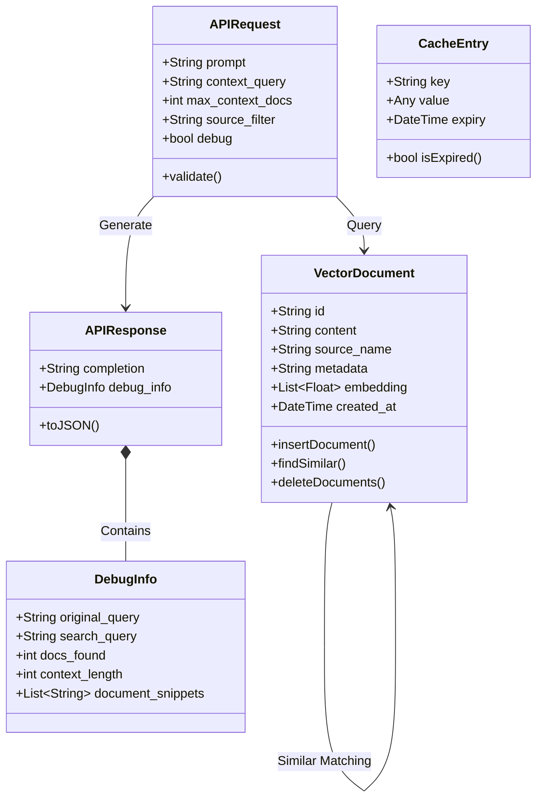
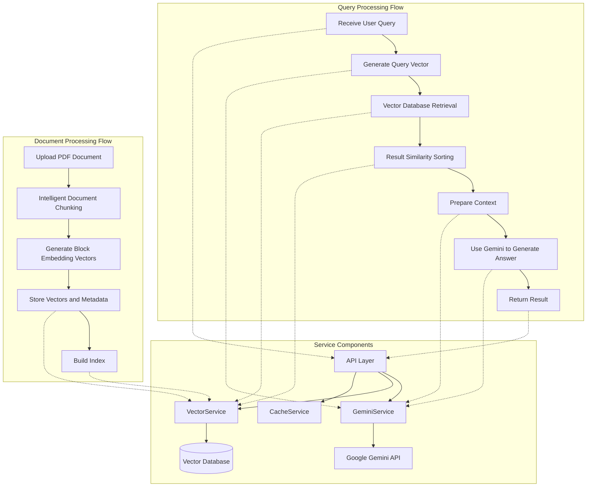
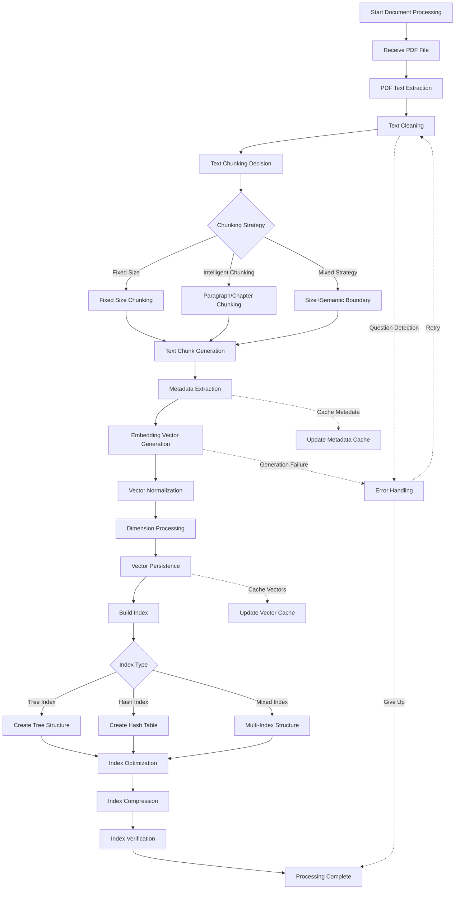
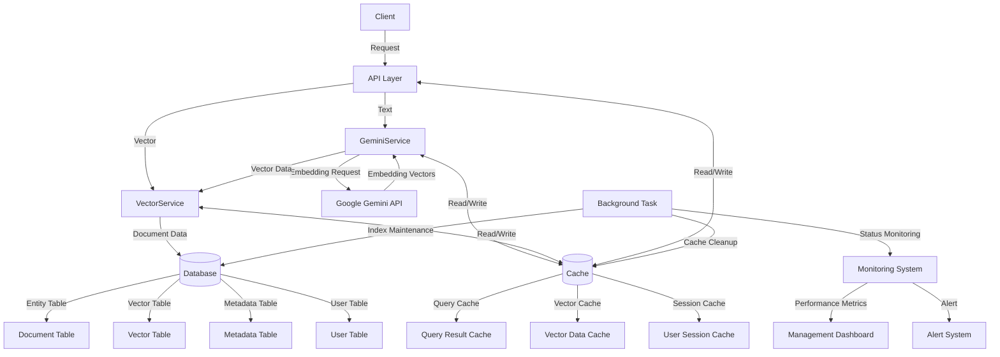

# Gemini Vector Search System

A document retrieval and analysis system based on Google Gemini model, supporting PDF document upload, intelligent chunking, vector search, and question answering functionality based on document content.

## System Architecture



## Main Processing Flow



## Code Structure



## Code Structure Detailed Diagram

### Data Model Relationship Diagram



### Query Processing Flow



### Document Processing and Vector Indexing Detailed Flow



### Data Flow and Storage Layer Interaction



## Main Features

1. **Document Management**
   - PDF document upload and parsing
   - Intelligent document chunking
   - Document vector storage

2. **Vector Search**
   - Semantic similarity retrieval
   - Document source filtering

3. **Intelligent Q&A**
   - Question answering based on document content
   - Structured content analysis
   - Automatic summary generation

### Directly Start Backend

```bash
python main.py

# Or use uvicorn
uvicorn app.main:app --host 0.0.0.0 --port 8000
```

### Use Bash Control Script

```bash
# Start service
./run.sh start-backend

# Stop service
./run.sh stop-backend

# View status
./run.sh status

# View logs
./run.sh logs
```

### Command Line Options

| Option | Description | Default Value |
|--------|-------------|-------------|
| `--host` | Service Host | 0.0.0.0 |
| `--port` | Service Port | 8000 |
| `--auto-reload` | Enable Auto Reload | false |
| `--logs` | Start with Logs | false |
| `--help`, `-h` | Display Help Information | - |

## Use Swagger API Documentation

The system has built-in Swagger API documentation interface, which can be accessed through the browser:

```
http://localhost:8000/docs
```

Swagger documentation provides:

1. Detailed description of all API endpoints
2. Structure of request and response models
3. Parameter description and example values
4. Online testing functionality, directly test API in browser

## References and Resources

In the development of this Gemini Vector Search System, we referenced the following technical resources:

### Google Gemini API

- [Google Generative AI Official Documentation](https://ai.google.dev/docs)
- [Gemini API Reference](https://ai.google.dev/api/python/google/generativeai)
- [Gemini Embedding Models](https://ai.google.dev/docs/embeddings_guide)

### Vector Retrieval and RAG Technology

- [Best Practices for Retrieval Augmented Generation (RAG)](https://www.pinecone.io/learn/retrieval-augmented-generation/)
- [Google Vector Search Documentation](https://cloud.google.com/vertex-ai/docs/vector-search/overview)
- [Practical Guide to Building RAG Applications](https://towardsdatascience.com/a-practical-guide-to-building-rag-applications-e9923bee2aa2)

### Document Intelligent Processing

- [PDF Processing and Text Extraction](https://pypdf2.readthedocs.io/en/latest/)
- [Intelligent Document Chunking Techniques](https://www.pinecone.io/learn/chunking-strategies/)
- [LangChain Document Processing Framework](https://python.langchain.com/docs/modules/data_connection/document_transformers/)

### FastAPI Framework

- [FastAPI Official Documentation](https://fastapi.tiangolo.com/)
- [SQLAlchemy and FastAPI Integration](https://fastapi.tiangolo.com/tutorial/sql-databases/)

### Frontend Technologies

- [Ant Design React UI Library](https://ant.design/docs/react/introduce)
- [React Framework Documentation](https://react.dev/learn)

### System Architecture

- [Vector Database Design Patterns](https://www.singlestore.com/blog/vector-database-design-patterns/)
- [Building High-Performance RAG System Architecture](https://www.databricks.com/blog/llm-rag-platform-upgrade-how-build-high-accuracy-retrieval-augmented-generation-applications)